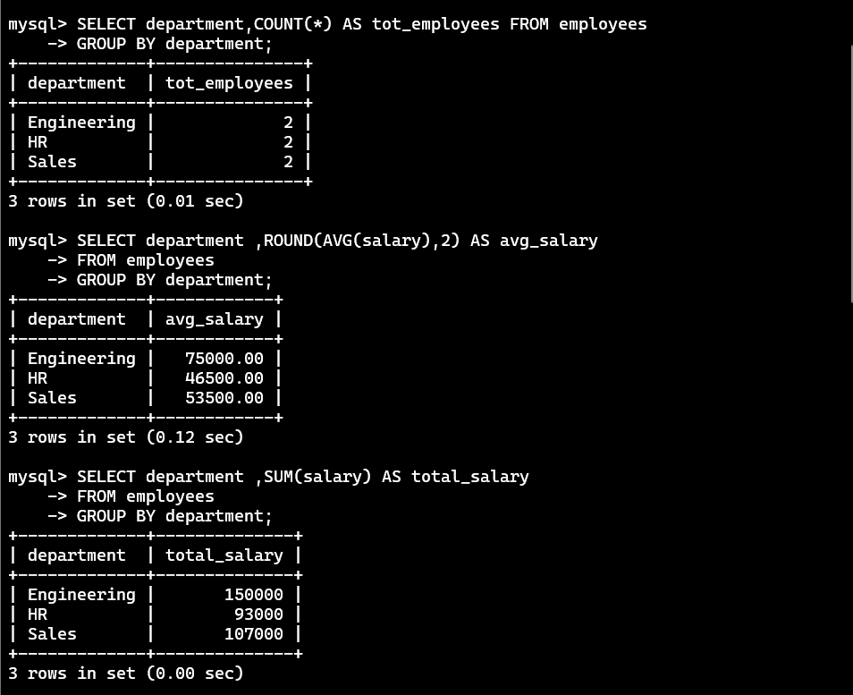
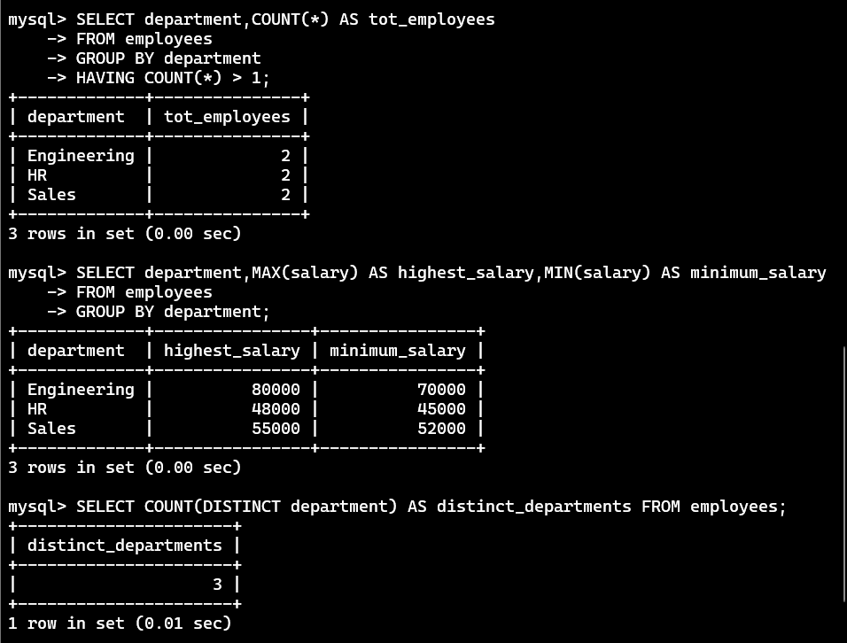

#  Task 4: Aggregate Functions and Grouping

## 📋 Task Overview

- **Objective:** Use aggregate functions and grouping to summarize data  
- **Tools:** DB Browser for SQLite / MySQL Workbench  
- **Key Concepts:** Aggregation, Grouping  
- **Deliverables:** SQL queries using SUM, COUNT, AVG, GROUP BY

---
## 🎯 Learning Objectives
- Apply aggregate functions on numeric columns
- Use `GROUP BY` to categorize data
- Filter groups using `HAVING` clause
- Develop ability to summarize and analyze tabular data
 
 ---
## 📊 Database Overview
**Table Name:** `employees`

### Sample Data
| id | name  | department  | salary | age |
|----|-------|-------------|--------|-----|
| 1  | Amit  | Engineering | 70000  | 26  |
| 2  | Sana  | Engineering | 80000  | 28  |
| 3  | Rina  | HR          | 45000  | 30  |
| 4  | Manoj | HR          | 48000  | 35  |
| 5  | Deep  | Sales       | 52000  | 27  |
| 6  | Priya | Sales       | 55000  | 29  |

---

## 1. Employee Count by Department
**Significance:** Shows the distribution of employees across different departments.

```sql
SELECT department, COUNT(*) AS tot_employees 
FROM employees
GROUP BY department;
```

#### Output

| department  | tot_employees |
|-------------|----------------|
| Engineering | 2              |
| HR          | 2              |
| Sales       | 2              |

---
## 2. Average Salary by Department
**Significance:** Calculates the average salary for each department, rounded to 2 decimal places.

```sql
SELECT department, ROUND(AVG(salary),2) AS avg_salary
FROM employees
GROUP BY department;
```

#### Output

| department  | avg_salary |
|-------------|------------|
| Engineering | 75000.00   |
| HR          | 46500.00   |
| Sales       | 53500.00   |

---
## 3. Total Salary Expenditure by Department
**Significance:** Shows the total salary cost for each department.

```sql
SELECT department, SUM(salary) AS total_salary
FROM employees
GROUP BY department;
```

#### Output

| department  | total_salary |
|-------------|--------------|
| Engineering | 150000       |
| HR          | 93000        |
| Sales       | 107000       |

---
## 4. Departments with Multiple Employees
**Significance:** Identifies departments that have more than 1 employee using `HAVING` clause.

```sql
SELECT department, COUNT(*) AS tot_employees
FROM employees
GROUP BY department
HAVING COUNT(*) > 1;
```

#### Output

| department  | tot_employees |
|-------------|----------------|
| Engineering | 2              |
| HR          | 2              |
| Sales       | 2              |

---
## 5. Salary Range by Department
**Significance:** Finds the highest and lowest salary in each department.

```sql
SELECT department, MAX(salary) AS highest_salary, MIN(salary) AS minimum_salary
FROM employees
GROUP BY department;
```

#### Output

| department  | highest_salary | minimum_salary |
|-------------|----------------|----------------|
| Engineering | 80000          | 70000          |
| HR          | 48000          | 45000          |
| Sales       | 55000          | 52000          |

---
## 6. Count of Distinct Departments
**Significance:** Calculates the number of unique departments in the organization.

```sql
SELECT COUNT(DISTINCT department) AS distinct_departments FROM employees;
```

#### Output

| distinct_departments |
|---------------------|
| 3                   |

---
## 7. Department with Highest Average Salar
**Significance:** Identifies the department with the highest average salary, ordered descending.

```sql
SELECT department, ROUND(AVG(salary),2) AS avg_salary
FROM employees
GROUP BY department
ORDER BY avg_salary DESC
LIMIT 1;
```

#### Output

| department  | avg_salary |
|-------------|------------|
| Engineering | 75000.00   |

---
## 8. High-Earning Employees by Department
**Significance:** Counts employees earning more than 50,000 in each department.

```sql
SELECT department, COUNT(*) AS cnt
FROM employees
WHERE salary > 50000
GROUP BY department;
```

#### Output

| department  | cnt |
|-------------|-----|
| Engineering | 2   |
| Sales       | 2   |

---
## 9. Departments with High Average Salary
**Significance:** Filters departments where average salary exceeds 65,000 using `HAVING` clause.

```sql
SELECT department, COUNT(*) AS cnt, AVG(salary) AS avg_salary
FROM employees
GROUP BY department
HAVING AVG(salary) > 65000;
```

#### Output

| department  | cnt | avg_salary |
|-------------|-----|------------|
| Engineering | 2   | 75000      |

---

- ### **Query Execution**





